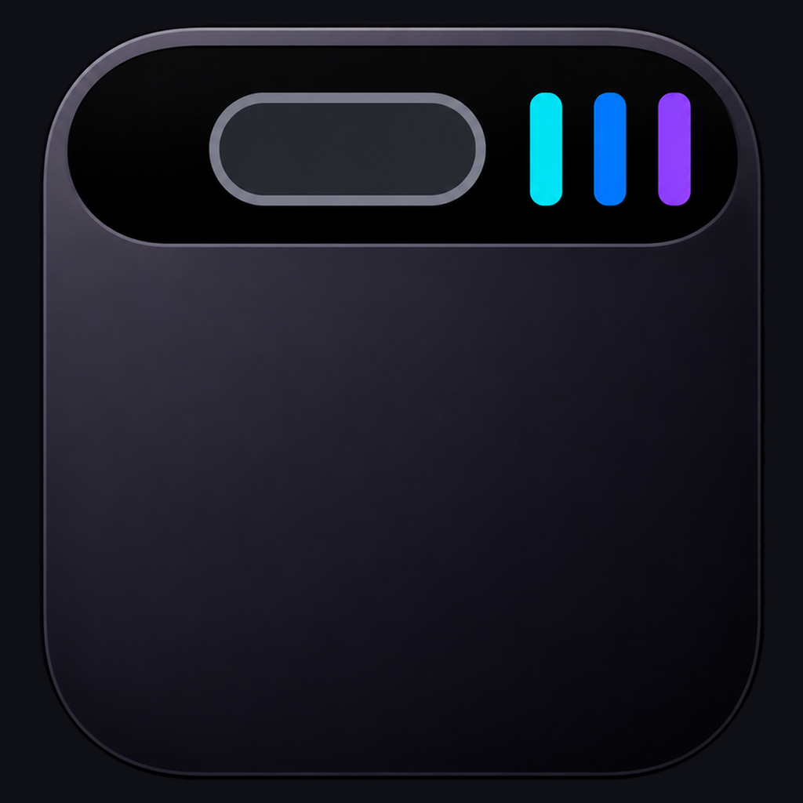

# 顶屿 TopIslet

> A lightweight activity island built around the MacBook notch.
> 把 MacBook 刘海周围变成低打扰、可交互的活动区域。



## 发布状态

当前版本为 **v0.1.1-alpha.4 开发者预览版**，优先验证汽水音乐同步、安全媒体控制、Apple Music Alpha 支持和顶部交互。它不是 Apple 或汽水音乐的官方产品，也暂不适合 App Store 分发。

项目代码采用 `GPL-3.0-only`，正式 Bundle ID 为 `io.github.scorpioxyb.topislet`。首个 GitHub Release 按 **ad-hoc 签名、未公证的 Alpha 开发者预览版**发布；Developer ID 与 Apple 公证暂缓，不把本版本描述为稳定版或免警告安装包。进度见 [发布检查清单](Docs/RELEASE_CHECKLIST.md)。

Developer ID 与 Apple 公证接入见 [签名与公证说明](Docs/APPLE_SIGNING_AND_NOTARIZATION.md)；MediaRemote Adapter 的固定上游 commit、项目补丁和逐字节重建记录见 [供应链与可复现构建](Docs/MEDIAREMOTE_ADAPTER_REPRODUCIBILITY.md)。

## 当前能力

- 围绕 MacBook 摄像头区域显示折叠、紧凑和展开三种状态。
- 读取汽水音乐的真实歌名、歌手、封面、播放状态与进度。
- 汽水播放 / 暂停、上一首、下一首只触发汽水窗口内经过结构校验的唯一语义控件，不发送全局媒体键。
- 进度条显示汽水专属可信进度；当前保持只读，不发送系统全局跳转命令。
- Apple Music Alpha 支持可读取歌曲、专辑封面、播放状态与进度，并通过定向 Apple Event 控制播放、切歌和绝对进度；电台曲目没有内嵌封面时，会在后台通过 Apple 公共目录精确匹配封面，不阻塞播放状态响应。前台切换到汽水或 Apple Music 时岛立即跟随，离开音乐应用后再按真实播放状态自动选择。
- 音乐设置页分别显示支持等级、应用运行状态、权限、连接结果和最近同步状态；Apple Music 适配默认开启，也可随时关闭。
- 计时器按需接管灵动岛，结束后恢复音乐活动。
- 日历和提醒事项经过用户单独授权后，可提供低打扰临近提醒。
- 支持悬停展开、移开收回、点击固定展开和刘海位置校准。

## 系统要求

| 项目 | 当前要求 |
| --- | --- |
| macOS | **macOS 26.0 或更高版本** |
| 设备 | 优先支持带刘海的 Apple Silicon MacBook |
| 音乐来源 | 汽水音乐主适配；Apple Music Alpha 支持 |
| 源码构建 | Xcode Command Line Tools、Swift 6 |

> MediaRemote Adapter 当前二进制的最低系统版本为 macOS 26.0，因此项目不再宣称兼容 macOS 14。其他系统版本需要重新构建并单独验证该依赖。

## 安装

### GitHub Release

正式 Release 准备完成后，可从 Releases 下载 `.dmg`：

1. 打开 `TopIslet-….dmg`。
2. 将“顶屿.app”拖到右侧“Applications”快捷入口。
3. 推出磁盘映像，再从“应用程序”文件夹打开顶屿。

顶屿是菜单栏 App，正常运行时不会出现在程序坞。在 Developer ID 签名和 Apple 公证完成前，下载包只会标记为开发者预览版；macOS 若阻止首次打开，可在 Finder 中右键顶屿并选择“打开”，不应关闭 Gatekeeper。

### 从源码运行

```bash
git clone https://github.com/Scorpioxyb/topislet.git
cd topislet
swift run MacBookIsland
```

本地打包安装：

```bash
bash Scripts/package-app.sh
open "/Applications/顶屿.app"
```

生成可分发候选包使用独立脚本：

```bash
VERSION="0.1.1" bash Scripts/build-release.sh
```

脚本会生成包含“顶屿.app”和“Applications”快捷入口的 arm64 DMG，以及对应的 SHA-256 校验和，不会自动发布到 GitHub。

## 第一次使用

1. 打开 App，确认菜单栏出现顶屿图标。
2. 从顶屿菜单打开“设置 → 音乐”；如果“辅助功能”显示待授权，点击“打开辅助功能设置”并允许当前 `/Applications/顶屿.app`。
3. 打开汽水音乐并播放歌曲，灵动岛会自动显示播放状态。
4. 点击或悬停顶部岛展开；移开后自动收回，点击展开则保持固定。
5. 如果胶囊与实体刘海不贴合，从顶屿菜单选择“校准布局...”。
6. 日历和提醒事项仅在“设置 → 日程”中按需单独授权。
7. 使用 Apple Music Alpha 支持时，在“设置 → 音乐”中检查并授权“自动化 - Apple Music”。顶屿不会自动启动 Apple Music；不需要时可关闭该适配。

> 从旧版“MacBook 灵动岛”升级：先退出旧版并将旧 `.app` 移到废纸篓，避免两个进程同时显示顶部岛。由于 App 显示名和 Bundle ID 已更改，macOS 会把顶屿识别为新的 App；首次启动后需要重新授予辅助功能权限，如启用日程功能，也需要重新授予日历和提醒事项权限。旧版布局和设置可能不会自动迁移。

## 权限与隐私

| 权限 | 是否必需 | 用途 |
| --- | --- | --- |
| 辅助功能 | 音乐控制必需 | 识别并触发汽水进程内经过结构校验的唯一语义控件 |
| 自动化 - Apple Music | 使用 Apple Music 时必需 | 按具体 Apple Music 进程读取播放状态并发送定向控制 |
| 日历 | 可选 | 读取临近开始的定时日程 |
| 提醒事项 | 可选 | 读取刚到期且具有具体时间的提醒 |
| 屏幕录制 | 不需要 | 项目不使用 OCR 或屏幕录制同步音乐 |

播放状态、日历和提醒数据在本机处理；Apple Music 未提供电台封面时，顶屿会把当前歌名与歌手发送给 Apple 的公开 iTunes Search，并从 Apple CDN 下载匹配图片。当前版本没有账号系统、云同步、广告 SDK、自有服务器或遥测上传。完整说明见 [PRIVACY.md](PRIVACY.md)。

## 已知限制

- 汽水音乐是当前产品级主适配；Apple Music 为 Alpha 支持，普通歌曲和可唯一匹配的电台曲目已支持专辑封面，暂不提供歌词，稳定性仍需更多设备与账号环境验证。
- 除汽水和 Apple Music 外，其他媒体应用不会自动获得完整控制能力。
- 项目依赖 macOS 非公开 MediaRemote 能力，系统更新可能导致兼容性变化。
- 当前没有汽水专属定向 seek 接口，因此进度条保持只读。
- Developer ID 签名与 Apple 公证尚未完成，当前本机包只是 ad-hoc 签名开发包。
- 目前主要在一台带刘海的 Apple Silicon MacBook 上验证，其他尺寸仍需实机校准。

## 诊断

```bash
.build/debug/MacBookIsland --music-adapters
.build/debug/MacBookIsland --apple-music-status
.build/debug/MacBookIsland --adapter-status
.build/debug/MacBookIsland --qishui-status
.build/debug/MacBookIsland --mediaremote-status
.build/debug/MacBookIsland --eventkit-status
```

诊断命令不会主动申请权限。开发调查记录见 [汽水适配说明](Docs/qishui-adapter-notes.md)。

## 开发

```bash
swift build
swift build -c release
swift test
bash -n Scripts/package-app.sh Scripts/build-release.sh Scripts/verify-release-source.sh Scripts/verify-release-dmg.sh
plutil -lint Packaging/Info.plist
```

顶屿运行且已适配音乐正在播放时，可执行 `swift Scripts/verify-island-window-animation.swift` 验证单窗口展开/收回的响应时间、连续中间尺寸、中心、顶边和目标尺寸。脚本结束后会恢复鼠标位置。

项目使用 SwiftUI + AppKit；主要模块说明见 [产品需求](Docs/PRODUCT_REQUIREMENTS.md)、[路线图](Docs/ROADMAP.md) 和 [QA 检查清单](Docs/QA_CHECKLIST.md)。

## 贡献与安全

- 贡献前请阅读 [CONTRIBUTING.md](CONTRIBUTING.md)。
- 安全问题请按 [SECURITY.md](SECURITY.md) 的方式私下报告。
- 发布步骤和未完成门禁见 [Docs/RELEASE_CHECKLIST.md](Docs/RELEASE_CHECKLIST.md)。

## 许可证与第三方组件

源代码按 [GNU General Public License v3.0 only](LICENSE)（`GPL-3.0-only`）授权。分发修改版时必须遵守 GPL v3 的源码提供、许可证保留及同许可证分发要求。

`TopIslet`、`顶屿`名称和项目 Logo 不随 GPL 代码许可证一并授权，不得以暗示官方版本、官方认可或合作关系的方式使用。详见 [TRADEMARKS.md](TRADEMARKS.md)。

MediaRemote Adapter 使用 BSD 3-Clause License。完整归属与当前供应链缺口见 [THIRD_PARTY_NOTICES.md](THIRD_PARTY_NOTICES.md)。

## 免责声明

MacBook、macOS、Dynamic Island 和 Apple 是 Apple Inc. 的商标或产品名称；汽水音乐属于其权利人。本项目与 Apple、汽水音乐及其关联公司不存在隶属、赞助或官方合作关系。
