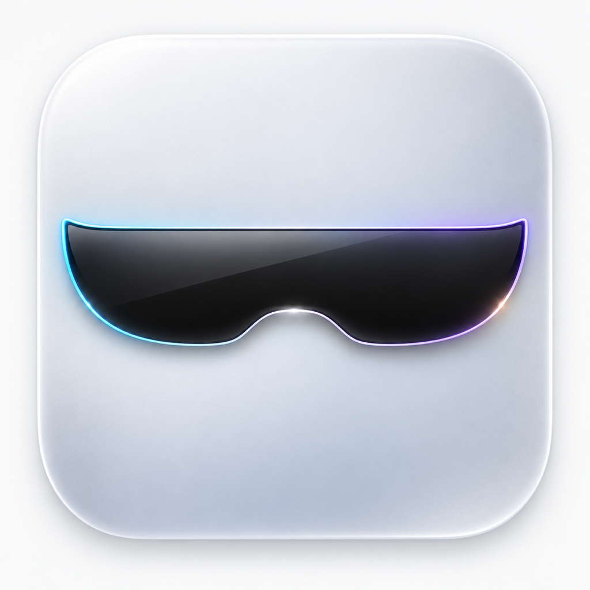
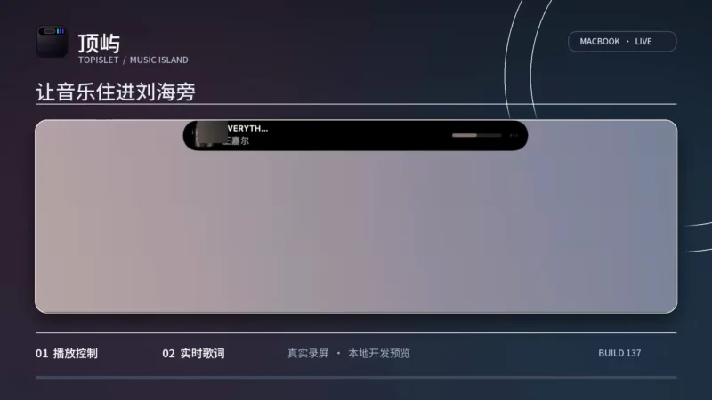
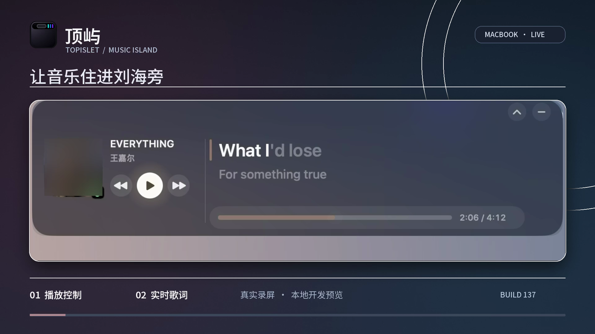
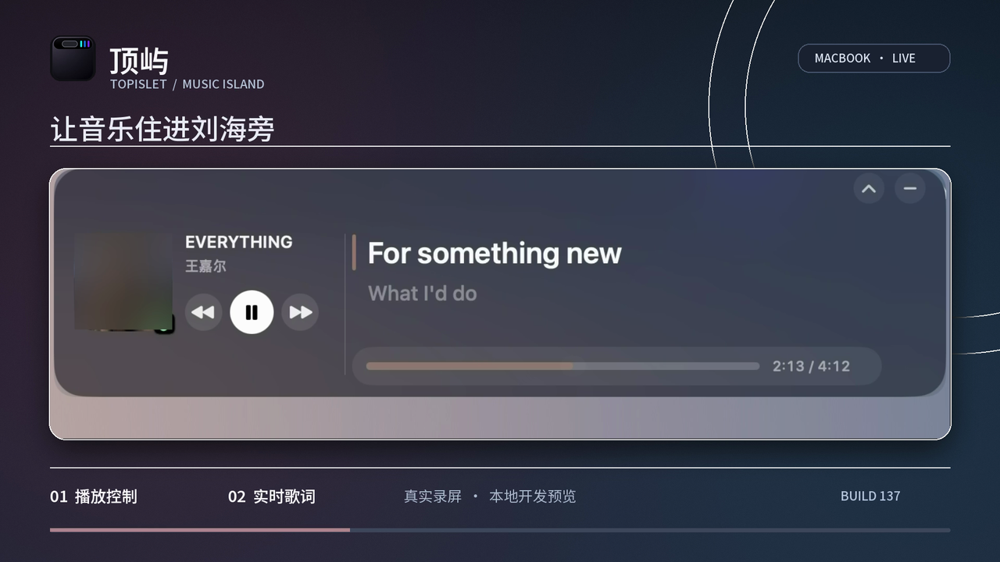
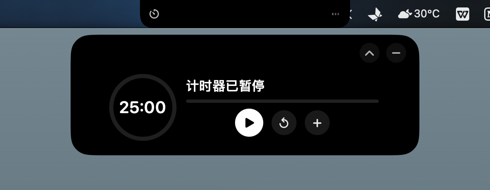

# 顶屿 TopIslet

> A lightweight activity island built around the MacBook notch.
> 把 MacBook 刘海周围变成低打扰、可交互的活动区域。



## 实际效果

<p align="center">
  
</p>

**[下载完整 30 秒演示视频（MP4）](https://github.com/Scorpioxyb/topislet/raw/refs/heads/main/Docs/assets/recordings/TopIslet-build137-2026-10-06-github-16x9-muted.mp4)** · [阅读本次开发更新](Docs/updates/2026-10-06-music-showcase.md)

上方直接展示约 11 秒循环预览；完整视频包含折叠、展开、点击播放和歌词变化。音乐画面录自本地 **0.1.3 build 137**，公开素材已静音并模糊第三方专辑封面。

### 音乐状态

<p align="center"></p>
<p align="center"><sub>折叠态：保留歌曲信息，收回完整控制面板</sub></p>

<p align="center"></p>
<p align="center"><sub>展开暂停态：左侧歌曲与控制，右侧歌词与进度</sub></p>

<p align="center"></p>
<p align="center"><sub>展开播放态：当前句、下一句和播放进度</sub></p>

<details>
<summary>查看专注计时的实机截图</summary>

<p align="center"></p>
<p align="center"></p>

上述计时截图为此前开发版本的运行记录。

</details>

> 音乐展示属于开发预览，尚未包含在公开下载包中。录屏只证明其中展示的操作与画面，不代表所有曲目、后台状态或设备场景均已通过验证。

## 发布状态

| 版本范围 | 当前状态 |
| --- | --- |
| 公开下载 | [v0.1.1-alpha.4](https://github.com/Scorpioxyb/topislet/releases/tag/v0.1.1-alpha.4)，Alpha 开发者预览版 |
| 源码开发预览 | **0.1.3 build 146**，统一浅银灰底板墨镜 Logo，包含歌词时间轴、切歌缓存与稳定性修正；不是稳定版 |
| 演示素材 | **build 137** 实机录屏，保留用于展示布局与交互；不代表最新版本已完成全部验收 |
| 本次 GitHub 更新 | 开发源码、[统一品牌图标](Docs/updates/2026-10-07-build146-brand.md)与[稳定性开发日志](Docs/updates/2026-10-07-build144-lyrics-stability.md)，没有新增 Release |

当前源码更新到 build 146；公开下载包仍为 v0.1.1-alpha.4，两者包含的功能不同。顶屿不是 Apple、汽水音乐或网易云音乐的官方产品，也暂不适合 App Store 分发。

项目代码采用 `GPL-3.0-only`，正式 Bundle ID 为 `io.github.scorpioxyb.topislet`。首个 GitHub Release 按 **ad-hoc 签名、未公证的 Alpha 开发者预览版**发布；Developer ID 与 Apple 公证暂缓，不把本版本描述为稳定版或免警告安装包。进度见 [v0.1.2 发布检查清单](Docs/RELEASE_CHECKLIST_0.1.2.md)。

Developer ID 与 Apple 公证接入见 [签名与公证说明](Docs/APPLE_SIGNING_AND_NOTARIZATION.md)；MediaRemote Adapter 的固定上游 commit、项目补丁和逐字节重建记录见 [供应链与可复现构建](Docs/MEDIAREMOTE_ADAPTER_REPRODUCIBILITY.md)。

## 当前能力

- 围绕 MacBook 摄像头区域显示折叠、紧凑和展开三种状态。
- 没有已适配音乐时，点击折叠岛可直接展开快捷面板；鼠标经过不会自动弹出，关闭后直接回到空岛。
- 读取汽水音乐的真实歌名、歌手、封面、播放状态与进度。
- 汽水歌词可使用经歌名、完整歌手名单和时长核验的词级时间轴，支持当前句、下一句、长句滚动与逐字高亮；缓存仅在本次运行期间保留，最多 24 首。没有可靠时间轴时尝试读取汽水窗口或桌面歌词，不保证所有歌曲和最小化场景可用。
- 汽水播放 / 暂停、上一首、下一首只触发汽水窗口内经过结构校验的唯一语义控件，不发送全局媒体键。
- 进度条显示汽水专属可信进度；在实时来源、唯一 PID、系统媒体焦点和无竞争播放均确认时支持点击 / 拖动跳转，校验失败则保持只读，避免误控其他播放器。
- Apple Music Alpha 支持可读取歌曲、专辑封面、播放状态与进度，并通过定向 Apple Event 控制播放、切歌和绝对进度；电台曲目没有内嵌封面时，会在后台通过 Apple 公共目录精确匹配封面，不阻塞播放状态响应。前台切换到汽水或 Apple Music 时岛立即跟随，离开音乐应用后再按真实播放状态自动选择。
- 网易云音乐 Alpha 支持按 `com.netease.163music` 当前 PID 定向读取歌曲、歌手、封面、播放状态和进度，并通过网易云进程内原生“控制”菜单执行播放 / 暂停、上一首和下一首；不使用系统当前媒体，也不会误控视频播放器。当前进度只读。
- 音乐设置页分别显示支持等级、应用运行状态、权限、连接结果和最近同步状态；Apple Music 适配默认开启，也可随时关闭。
- 计时器按需接管灵动岛，结束后恢复音乐活动。
- 日历和提醒事项经过用户单独授权后，可提供低打扰临近提醒。
- 支持悬停展开、移开收回、点击固定展开和刘海位置校准。
- 菜单栏和“活动”设置页可启动 `5/15/25/45` 分钟专注计时；已授权后，未来 10 分钟内的日历事件和刚到期提醒事项可短暂接管顶屿，随后恢复音乐或计时活动。

## 系统要求

### 歌词与网络

「显示歌词」开关默认关闭。开启后，除了窗口读取，还会向汽水相关的搜索服务发送当前歌名和歌手，并请求匹配歌曲的词级歌词详情；不发送账号、播放历史、日历或提醒内容。候选歌词会经过歌名、完整歌手名单和时长校验，不能确定版本时保持空结果。关闭开关会取消请求并清空歌词时间轴缓存。

第三方歌词接口可能变化或不可用；纯音乐和未提供歌词的曲目也可能没有歌词。窗口与桌面歌词读取仍受汽水辅助功能树是否可用影响。暂停时拖动进度采用状态回读恢复暂停，可能短暂恢复播放后再暂停，尚未达到无感保持。

### 设备与工具链

| 项目 | 当前要求 |
| --- | --- |
| macOS | **macOS 26.0 或更高版本** |
| 设备 | 优先支持带刘海的 Apple Silicon MacBook |
| 音乐来源 | 汽水音乐主适配；Apple Music、网易云音乐 Alpha 支持 |
| 源码构建 | Xcode Command Line Tools、Swift 6 |

> MediaRemote Adapter 当前二进制的最低系统版本为 macOS 26.0，因此项目不再宣称兼容 macOS 14。其他系统版本需要重新构建并单独验证该依赖。

## 安装

### GitHub Release

正式 Release 准备完成后，可从 Releases 下载 `.dmg`：

1. 打开 `TopIslet-….dmg`。
2. 将“顶屿.app”拖到右侧“Applications”快捷入口。
3. 推出磁盘映像，再从“应用程序”文件夹打开顶屿。

顶屿是菜单栏 App，正常运行时不会出现在程序坞。在 Developer ID 签名和 Apple 公证完成前，下载包只会标记为开发者预览版；macOS 若阻止首次打开，可在 Finder 中右键顶屿并选择“打开”，不应关闭 Gatekeeper。

### 从源码运行

```bash
git clone https://github.com/Scorpioxyb/topislet.git
cd topislet
swift run MacBookIsland
```

本地打包安装：

```bash
bash Scripts/package-app.sh
open "/Applications/顶屿.app"
```

本地安装默认使用 Release 构建，确保日常动画与同步性能接近发布包；仅在排障时可使用 `BUILD_CONFIGURATION=debug bash Scripts/package-app.sh`。

生成可分发候选包使用独立脚本：

```bash
python3 -m venv .build/dmg-tools
.build/dmg-tools/bin/python3 -m pip install -r Scripts/dmg-layout-requirements.txt
VERSION="0.1.3" bash Scripts/build-release.sh
```

脚本会生成包含“顶屿.app”和“Applications”快捷入口的 arm64 DMG，以及对应的 SHA-256 校验和，不会自动发布到 GitHub。

## 第一次使用

1. 打开 App，确认菜单栏出现顶屿图标。
2. 从菜单栏顶屿图标打开设置，或右键点击岛本体选择“设置…”；进入“音乐”，如果“辅助功能”显示待授权，点击“打开辅助功能设置”并允许当前 `/Applications/顶屿.app`。右键菜单也可正常退出顶屿。
3. 打开汽水音乐并播放歌曲，灵动岛会自动显示播放状态。
4. 点击或悬停顶部岛展开；移开后自动收回，点击展开则保持固定。
5. 如果胶囊与实体刘海不贴合，从顶屿菜单选择“校准布局...”。
6. 专注计时、日历和提醒事项位于“设置 → 活动”；日历与提醒事项按需单独授权。
7. 使用 Apple Music Alpha 支持时，在“设置 → 音乐”中检查并授权“自动化 - Apple Music”。顶屿不会自动启动 Apple Music；不需要时可关闭该适配。
8. 如需开机后自动运行，在“设置 → 常规”开启“登录时自动启动顶屿”。开关读取 macOS 的真实登录项状态；若显示“等待系统批准”，请按页面入口到系统设置中允许。
9. 使用网易云音乐 Alpha 支持时，打开网易云音乐并播放歌曲；状态读取无需额外权限，三个播放按钮需要辅助功能权限。

> 从旧版“MacBook 灵动岛”升级：先退出旧版并将旧 `.app` 移到废纸篓，避免两个进程同时显示顶部岛。由于 App 显示名和 Bundle ID 已更改，macOS 会把顶屿识别为新的 App；首次启动后需要重新授予辅助功能权限，如启用日程功能，也需要重新授予日历和提醒事项权限。旧版布局和设置可能不会自动迁移。

## 权限与隐私

| 权限 | 是否必需 | 用途 |
| --- | --- | --- |
| 辅助功能 | 汽水、网易云音乐控制必需 | 识别并触发目标音乐进程内经过结构校验的语义控件 |
| 自动化 - Apple Music | 使用 Apple Music 时必需 | 按具体 Apple Music 进程读取播放状态并发送定向控制 |
| 日历 | 可选 | 读取临近开始的定时日程 |
| 提醒事项 | 可选 | 读取刚到期且具有具体时间的提醒 |
| 屏幕录制 | 不需要 | 项目不使用 OCR 或屏幕录制同步音乐 |

播放状态、日历和提醒数据在本机处理；Apple Music 未提供电台封面时，顶屿会把当前歌名与歌手发送给 Apple 的公开 iTunes Search，并从 Apple CDN 下载匹配图片。当前版本没有账号系统、云同步、广告 SDK、自有服务器或遥测上传。完整说明见 [PRIVACY.md](PRIVACY.md)。

## 已知限制

- 汽水音乐是当前产品级主适配；Apple Music 与网易云音乐为 Alpha 支持，暂不提供歌词，稳定性仍需更多设备、账号和音乐类型验证。
- 网易云音乐当前不提供定向进度跳转；不同封面切歌本机实测约 `0.76s` 原子更新，同专辑同封面仍会保守执行双快照确认。
- 除汽水、Apple Music 和网易云音乐外，其他媒体应用不会自动获得完整控制能力。
- 项目依赖 macOS 非公开 MediaRemote 能力，系统更新可能导致兼容性变化。
- 汽水尚未提供客户端专属 seek 接口；当前进度跳转是受保护的系统媒体焦点操作，只在来源、PID、实时状态和竞争播放校验全部通过时执行，不能宣称为真正的汽水定向 seek。
- Developer ID 签名与 Apple 公证尚未完成，当前本机包只是 ad-hoc 签名开发包。
- 已通过系统屏幕几何自动适配和 Air 13/15、Pro 14/16 测试矩阵；除当前 15 英寸 Air 外，其他机型仍需要真机截图完成最终像素级验收。

## 诊断

```bash
.build/debug/MacBookIsland --music-adapters
.build/debug/MacBookIsland --apple-music-status
.build/debug/MacBookIsland --netease-music-status
.build/debug/MacBookIsland --netease-music-adapter-control next
.build/debug/MacBookIsland --adapter-status
.build/debug/MacBookIsland --qishui-status
.build/debug/MacBookIsland --qishui-control-availability
.build/debug/MacBookIsland --qishui-control-diagnostic
.build/debug/MacBookIsland --mediaremote-status
.build/debug/MacBookIsland --eventkit-status
.build/debug/MacBookIsland --display-geometry
swift run DailyUsageAnalyzer --last 24h
```

诊断命令不会主动申请权限。`DailyUsageAnalyzer` 只汇总本机 Unified Logging 中的结构化事件，默认把聚合报告写入 `.build/qa/`；可分别统计点击到 UI、播放器权威确认和 seek 真实收敛的延迟，并明确区分无媒体活动、样本不完整和样本完整。App 每 15 分钟复用现有状态 tick 写入一次匿名健康心跳，不增加媒体轮询。曲目只使用 12 位截断哈希指纹，不记录完整歌名、歌手、歌词或封面。开发调查记录见 [汽水适配说明](Docs/qishui-adapter-notes.md)。

`--qishui-status` 分别输出 `PRIMARY_MEDIA_SOURCE`（主媒体源）和 `AX_FALLBACK_SOURCE`（辅助功能补充源）。判断播放状态和进度时，保留分段标题并检查主源的 `verifiedQishuiSource`、`sourceProcessIdentifier`；AX 的 `isPlaying=unknown` 表示该补充源未读到播放状态，不表示主源的真实状态失效。不要将两个分段中的同名字段合并成一份状态。

## 开发

```bash
swift build
swift build -c release
swift test
bash -n Scripts/package-app.sh Scripts/build-release.sh Scripts/verify-release-source.sh Scripts/verify-release-dmg.sh
plutil -lint Packaging/Info.plist
```

顶屿运行且已适配音乐正在播放时，可执行 `swift Scripts/verify-island-window-animation.swift` 验证单窗口展开/收回的响应时间、连续中间尺寸、中心、顶边和目标尺寸。脚本结束后会恢复鼠标位置。

项目使用 SwiftUI + AppKit；主要模块说明见 [产品需求](Docs/PRODUCT_REQUIREMENTS.md)、[路线图](Docs/ROADMAP.md) 和 [QA 检查清单](Docs/QA_CHECKLIST.md)。

## 贡献与安全

- 贡献前请阅读 [CONTRIBUTING.md](CONTRIBUTING.md)。
- 安全问题请按 [SECURITY.md](SECURITY.md) 的方式私下报告。
- 发布步骤和未完成门禁见 [Docs/RELEASE_CHECKLIST_0.1.2.md](Docs/RELEASE_CHECKLIST_0.1.2.md)。

## 许可证与第三方组件

源代码按 [GNU General Public License v3.0 only](LICENSE)（`GPL-3.0-only`）授权。分发修改版时必须遵守 GPL v3 的源码提供、许可证保留及同许可证分发要求。

`TopIslet`、`顶屿`名称和项目 Logo 不随 GPL 代码许可证一并授权，不得以暗示官方版本、官方认可或合作关系的方式使用。详见 [TRADEMARKS.md](TRADEMARKS.md)。

MediaRemote Adapter 使用 BSD 3-Clause License。完整归属与当前供应链缺口见 [THIRD_PARTY_NOTICES.md](THIRD_PARTY_NOTICES.md)。

## 免责声明

MacBook、macOS、Dynamic Island 和 Apple 是 Apple Inc. 的商标或产品名称；汽水音乐和网易云音乐属于各自权利人。本项目与上述公司及其关联方不存在隶属、赞助或官方合作关系。
